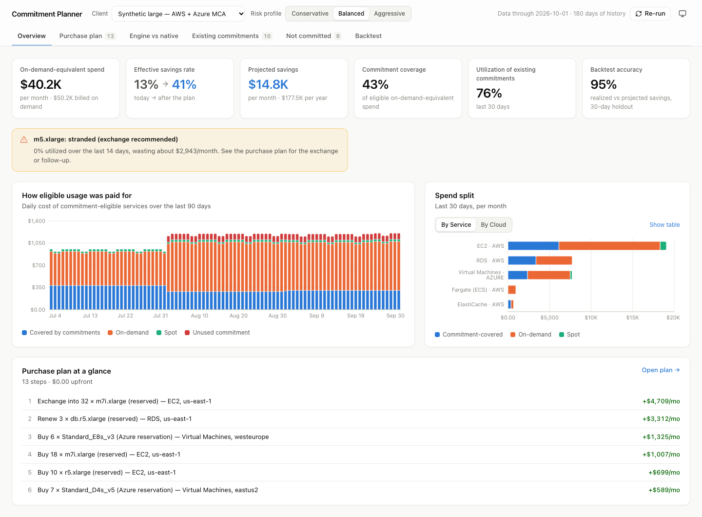
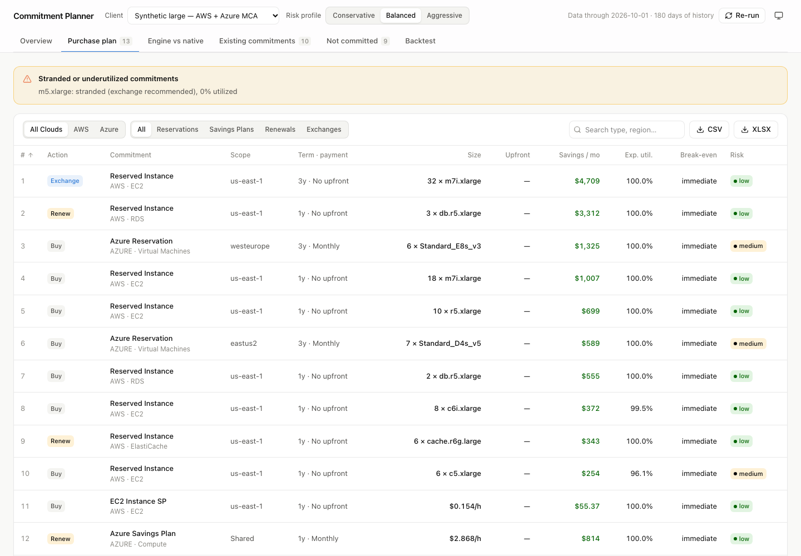
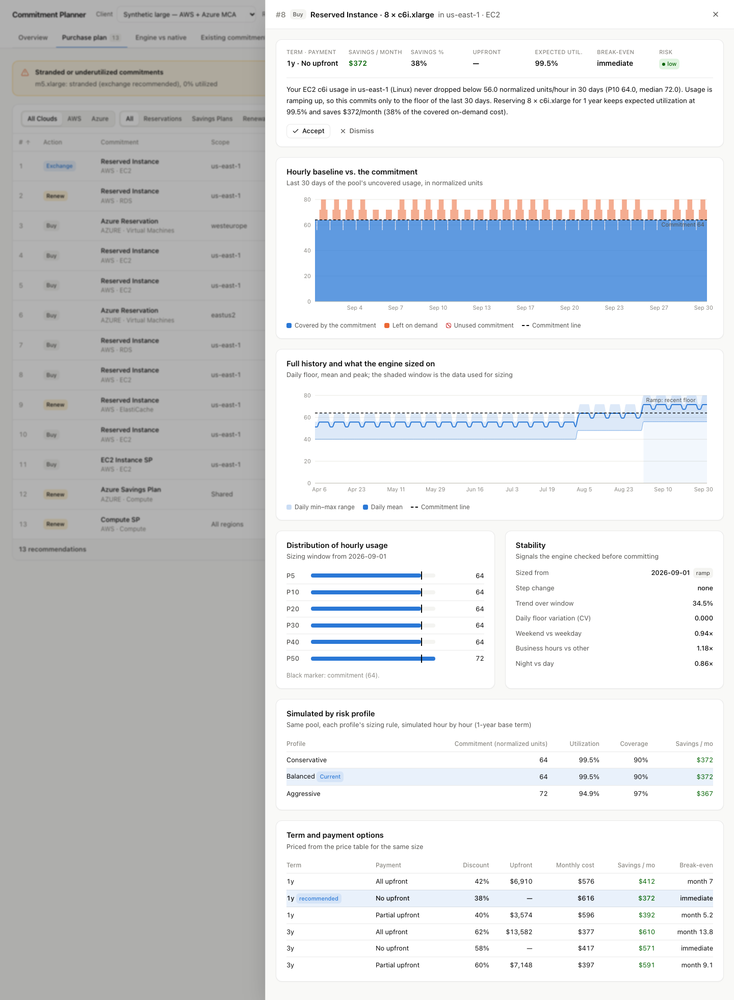
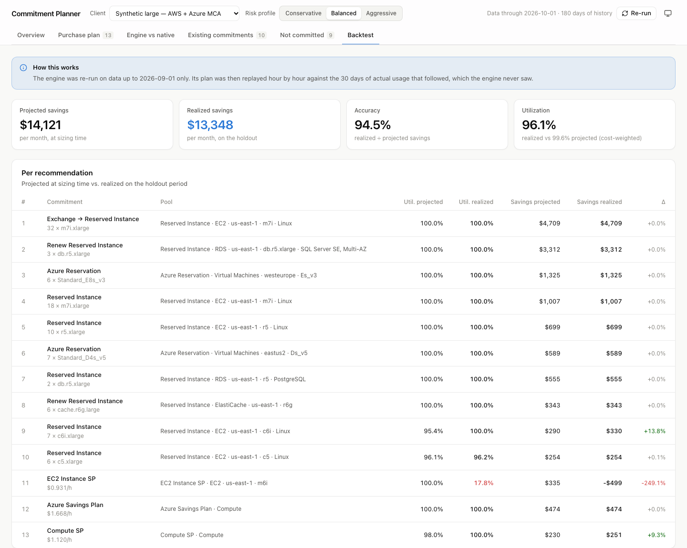

# Savings Tool

Hosted SaaS that pulls AWS and Azure usage, analyzes it, and recommends savings plans and reservations.

## Layout

```
backend/            Python 3.12, FastAPI
  app/api/          HTTP routes (only /health so far)
  app/models/       SQLAlchemy models (Postgres)
  app/collectors/   aws/ and azure/ collectors: usage, commitments, utilization, native recs
  app/usage/        normalized usage schema, Parquet store, FOCUS / CUR 2.0 normalizers
  app/pricing/      AWS Pricing API + SP offering rates, Azure Retail Prices
  app/services/     collection run orchestration, price upserts
  app/synthetic/    synthetic tenants (small, medium, large, startup)
  app/engine/       recommendation engine: pools, stability, layering, sizing, summary
  app/workers/      background jobs (arq on Redis): collect_usage, refresh_prices, run_analysis
  migrations/       Alembic migrations
  tests/            unit tests with mocked AWS/Azure responses (tests/fixtures/)
frontend/           Next.js (App Router, TypeScript)
infra/              CloudFormation for the client's read-only IAM role (with ExternalId)
docker-compose.yml  Postgres 16 (localhost:5433) and Redis 7 (localhost:6380) for local development
```

## Demo, end to end

```sh
docker compose up -d                                   # Postgres :5433, Redis :6380

cd backend
python3.12 -m venv .venv && source .venv/bin/activate
pip install -e '.[dev]'
alembic upgrade head
python -m app.synthetic --seed-db --analyze            # 4 synthetic clients, 3 risk profiles each (~2 min)
uvicorn app.main:app --port 8000                       # API

cd ../frontend                                         # in a second shell
npm install
npm run dev -- -p 3100                                 # UI: http://localhost:3100
```

The UI has no login or onboarding (it is a demo). Pick a client and risk profile in the header:

- **Overview**: commitment-eligible spend (at on-demand rates), effective savings rate today vs after the plan,
  projected savings, coverage, utilization of existing commitments, backtest accuracy, how
  eligible usage was paid for (daily) and the spend split by service / cloud.
- **Purchase plan**: the ordered plan (sortable, filterable by cloud and type, CSV / XLSX
  export) with urgent renewals and stranded commitments called out. Click a row for the
  detail: hourly baseline vs the commitment line (covered / on-demand / unused), full history
  with the sizing window and step changes, percentiles and stability signals, the rationale,
  1y / 3y and payment options, and the simulation for each risk profile.
- **Engine vs native**: our plan against AWS / Azure's own recommendations, with the reasons.
- **Existing commitments**: utilization over time; expiring, stranded, underutilized flagged.
- **Not committed**: Spot, nightly, business-hours, too-new and migrated-away usage, and why.
- **Backtest**: the engine re-run on data up to 30 days before the end, its plan replayed
  against the 30 days it never saw: realized vs projected utilization and savings.

Append `&theme=light` or `&theme=dark` to any URL to force a theme.






## Connecting a real AWS account

Open a client (or **Client → + New client…**), go to the **Connections** tab and add an AWS
connection. Collection runs in the background worker, so start it next to the API:

```sh
cd backend && arq app.workers.main.WorkerSettings
```

The API and the worker read AWS credentials from the machine they run on.

**Local credentials** (simplest, for testing your own account; no AWS CLI needed):

1. In the AWS console: **IAM → Users → Create user** (no console access) → **Attach policies
   directly → Create policy → JSON**, paste the policy below, and attach it.
2. Open the user → **Security credentials → Create access key** ("Application running
   outside AWS"). Copy both keys; the secret is shown once.
3. On the machine running the tool, create the text file `~/.aws/credentials`:

   ```ini
   [default]
   aws_access_key_id = <Access key ID>
   aws_secret_access_key = <Secret access key>
   ```

4. In the connection form leave **Credentials profile** empty (default credential chain), or use
   another section name such as `[savings-tool]` and enter it there. Restart the worker after
   creating the file. The tool never stores keys; delete the access key when you finish testing.

The policy (read-only):

```json
{
  "Version": "2012-10-17",
  "Statement": [{
    "Effect": "Allow",
    "Action": [
      "ce:GetCostAndUsage", "ce:GetDimensionValues", "ce:GetReservationUtilization",
      "ce:GetReservationPurchaseRecommendation", "ce:GetSavingsPlansUtilizationDetails",
      "ce:GetSavingsPlansPurchaseRecommendation",
      "savingsplans:DescribeSavingsPlans", "savingsplans:DescribeSavingsPlansOfferingRates",
      "ec2:DescribeRegions", "ec2:DescribeReservedInstances", "rds:DescribeReservedDBInstances",
      "elasticache:DescribeReservedCacheNodes", "redshift:DescribeReservedNodes",
      "es:DescribeReservedInstances", "memorydb:DescribeReservedNodes",
      "organizations:DescribeOrganization", "organizations:ListAccounts",
      "pricing:GetProducts", "s3:ListBucket", "s3:GetObject"
    ],
    "Resource": "*"
  }]
}
```

**Cross-account role** (how a real client connects): the tool generates an ExternalId. In the
account to analyse, open **CloudFormation → Create stack → With new resources → Upload a
template file**, choose `infra/client-readonly-role.yaml` (also downloadable from the
connection card), and set **ToolAccountId** (the account whose credentials the tool runs with;
for a test on your own machine, your own account ID) and **ExternalId** (from the UI).
Acknowledge IAM resource creation, submit, and copy **RoleArn** from the stack's **Outputs**
into the connection. The tool still needs local credentials (above) to assume the role.

<details><summary>Alternative: deploy the role with the AWS CLI</summary>

The connection card shows the exact `aws cloudformation deploy` command with your ExternalId;
set `TOOL_AWS_ACCOUNT_ID` in `backend/.env` to have the tool account filled in.

</details>

Then **Test connection** (STS identity, one Cost Explorer call, account list) and **Collect
data**. Without a Data Export, history comes from a 13-month Cost Explorer backfill (daily).
Cost Explorer bills **$0.01 per API call**; a first collection makes roughly 50–100 calls and the
run table shows the exact count. Responses are cached for 24 hours. When collection finishes the
analysis re-runs and the dashboard shows the plan. Small accounts often get no recommendations;
the **Not committed** tab says why for each usage pool.

Notes: Cost Explorer must be enabled for the account (Billing console); regions or services the
credentials can't read are recorded as warnings on the run instead of failing it.

## Prerequisites

- Python 3.12
- Node.js 20+
- Docker (for Postgres and Redis)

## Setup

Start Postgres and Redis:

```sh
docker compose up -d
```

They are published on 5433 and 6380 rather than the default ports so they don't collide with a
locally installed Postgres or Redis.

Backend:

```sh
cd backend
python3.12 -m venv .venv
source .venv/bin/activate
pip install -e '.[dev]'
cp .env.example .env
alembic upgrade head
uvicorn app.main:app --reload          # http://localhost:8000/health
arq app.workers.main.WorkerSettings    # background worker (separate shell)
```

Frontend:

```sh
cd frontend
npm install
cp .env.example .env.local             # API_URL: where Next proxies /api/* to
npm run dev                            # http://localhost:3000
```

## Tests and lint

```sh
cd backend && pytest && ruff check . && ruff format --check .   # DB tests need docker compose up
cd frontend && npm run lint && npm test && npm run build
```

## Usage data

Normalized usage (FOCUS-aligned columns, see `backend/app/usage/schema.py`) is written as
Parquet under `USAGE_STORAGE_ROOT` (local path in dev, `s3://...` in prod):

```
usage_hourly/tenant=<id>/provider=<aws|azure>/date=YYYY-MM-DD/part-0.parquet
```

Each write replaces whole day partitions. Query it with DuckDB (`hive_partitioning = true`);
`app.usage.query.connect(store, tenant_id)` gives a connection with a `usage` view.
Native provider recommendations are saved next to it under `native_recommendations/`.

## Collection

`collect_usage(cloud_connection_id)` (worker job, or `app.services.collection.run_collection`):

1. Tests the connection and syncs accounts / subscriptions.
2. Reads the client's billing export (AWS Data Exports FOCUS 1.0 or CUR 2.0; Azure Cost
   Management FOCUS export) - the primary source.
3. Backfills up to 13 months from the API (Cost Explorer / Cost Management Query) for days
   the export doesn't cover yet. Cost Explorer calls cost $0.01 each, so responses are cached
   in `API_CACHE_DIR` and every call is counted in `collection_run.api_calls`.
4. Inventories existing savings plans and reservations, their daily utilization, and the
   provider's own purchase recommendations.

### AWS onboarding

The client deploys `infra/client-readonly-role.yaml` in their payer account (see below). Set
`CreateDataExport=true` (in us-east-1) to also create an hourly Parquet Data Export and bucket;
the stack outputs give `aws_role_arn`, `aws_export_bucket` and `aws_export_prefix`.

### Azure onboarding

The tool uses one multi-tenant Entra app that signs in with a certificate
(`AZURE_APP_CLIENT_ID`, `AZURE_APP_CERTIFICATE_PATH`). The client consents to it in their
tenant and grants read access at their billing scope, which depends on the agreement type
(`azure_agreement_type`):

| type | `azure_billing_scope` |
|------|------------------------|
| ea   | `/providers/Microsoft.Billing/billingAccounts/<enrollment number>` |
| mca  | `/providers/Microsoft.Billing/billingAccounts/<id>/billingProfiles/<profile id>` |
| payg | `/subscriptions/<subscription id>` |
| csp  | `/providers/Microsoft.Billing/billingAccounts/<id>/customers/<customer id>` |

Plus Reservations Reader and Savings plan Reader, and Storage Blob Data Reader on the FOCUS
export container (`azure_export_container`, e.g. `https://acct.blob.core.windows.net/costs/exports`).

## Synthetic data

For development without a cloud account:

```sh
cd backend
python -m app.synthetic                     # all profiles, Parquet only
python -m app.synthetic --profile large --seed-db   # also tenant, commitments, prices in Postgres
```

Profiles (deterministic):
- `small` (AWS only, 90 days): Compute SP expiring in 10 days, flat unreserved RDS Postgres
  Multi-AZ and ElastiCache, business-hours batch.
- `medium` (Azure EA, 120 days): 20 VMs vs 15 reserved, a 5 -> 20 ramp, a D4s_v4 RI stranded by
  a move to D4as_v5, Cosmos DB with peaks, SQL vCores, App Service, Postgres flexible server.
- `large` (AWS org + Azure MCA, 180 days): layered SPs and RIs, 50x m5 RI stranded by a move
  to m7i, growing workload, staging, nightly batch, Spot, a new workload, Windows, SQL Server
  RDS, an ElastiCache cluster with 4 of 6 nodes reserved and expiring.
- `startup` (AWS + Azure PAYG, 21 days, no commitments).
- `data` (AWS, 120 days, no commitments): RDS, ElastiCache, DynamoDB provisioned capacity,
  DocumentDB, Lambda and SageMaker - one of each non-EC2 commitment type.

`app.synthetic.analysis.analyze_synthetic(tenant, store)` runs the engine on a tenant directly.

## Recommendation engine

`run_analysis` (worker job, or `POST /tenants/{id}/analysis-runs`) sizes savings plans and
reservations by simulating them over the tenant's hourly usage, and stores the results next to
the providers' own (native) recommendations:

1. **Baseline** per commitment pool (reservations by family/region/OS or exact type,
   EC2 Instance SP by family/region, Compute / Database / SageMaker SPs and the Azure SP
   account-wide), excluding Spot
   and usage already under commitments - except those ending within 90 days, which count as
   ending so renewals are recommended (kept to the same commitment type).
2. **Stability**: percentiles, trend, weekday/weekend, business-hours and nightly patterns,
   abrupt step changes (migrations, decommissions). After a step only later data is used;
   ramps commit to the recent floor; workloads younger than 21 days wait.
3. **Layering** as the providers apply it: reservations, then EC2 Instance SPs, then
   Compute / Database / SageMaker / Azure SPs, each sized on what earlier layers leave
   uncovered. A savings plan only counts usage it has a rate for (not storage, I/O, backups). Stranded
   reservations are exchanged into the replacing usage first where the provider allows it.
4. **Sizing**: every hour is simulated for each candidate size; conservative ~P10, balanced =
   net-savings optimum, aggressive = higher coverage, never below the profile's target
   utilization (98 / 95 / 90%).
5. **Terms**: 1y/3y and No/Partial/All Upfront priced from the `price` table, with upfront,
   monthly cost and break-even; 1y No Upfront unless usage is long, flat and 3y pays back fast.
6. **Explain**: each row has a plain-language rationale and chart series (`details.chart`).

The run's `summary` has on-demand spend, coverage, utilization of existing commitments,
expiring and stranded commitments, the ordered purchase plan, projected savings, the new
effective savings rate and a comparison with the native recommendations.

```sh
curl -X POST localhost:8000/tenants/<id>/analysis-runs -H 'content-type: application/json' \
     -d '{"risk_profile": "balanced", "wait": true}'
curl localhost:8000/tenants/<id>/analysis-runs/latest
curl "localhost:8000/tenants/<id>/analysis-runs/<run id>/recommendations?source=engine"
```

Coverage (AWS):

| Usage | Reservations | Savings Plans |
|---|---|---|
| EC2 | Linux, shared tenancy (size-flexible) | EC2 Instance, Compute |
| Fargate, Lambda | - | Compute |
| SageMaker | - | SageMaker |
| RDS / Aurora, ElastiCache, OpenSearch | instances / nodes | Database |
| DynamoDB | provisioned read/write capacity (1 year, blocks of 100) | Database (also on-demand) |
| Redshift (nodes, Serverless RPUs), MemoryDB | yes | - |
| DocumentDB, Neptune, Timestream, DMS, Keyspaces, Aurora DSQL | - (none sold) | Database |

Database Savings Plans are 1-year No Upfront only.

## Pricing

`refresh_prices` (worker job) loads public prices into the `price` table: AWS Pricing API
(on-demand and RI) and Savings Plans offering rates, using the tool's own AWS credentials, and
the Azure Retail Prices API (no auth). After a collection, only the prices of what that client
uses are synced. EC2 is keyed by instance type, OS and tenancy; every other AWS service by the
usage type and operation it is billed under, which usage (Cost Explorer, CUR, FOCUS), the
Pricing API and Savings Plans rates all carry (`app/pricing/keys.py`).

## Migrations

After changing models in `backend/app/models/`, with Postgres running:

```sh
cd backend
alembic revision --autogenerate -m "describe the change"
alembic upgrade head
```

To see the SQL without a database: `alembic upgrade head --sql`.

## Client AWS onboarding

`infra/client-readonly-role.yaml` is deployed by the client in their payer account. It creates a role
that only the tool's AWS account can assume, and only with the client's ExternalId. It grants read access
to Cost Explorer, Savings Plans and reservation APIs, Organizations account listing, and optionally the
client's CUR / Data Exports bucket. The role ARN from the stack output is entered in the tool.

```sh
aws cloudformation deploy \
  --template-file infra/client-readonly-role.yaml \
  --stack-name savings-tool-readonly \
  --capabilities CAPABILITY_NAMED_IAM \
  --parameter-overrides ToolAccountId=<tool account id> ExternalId=<issued external id>
```
